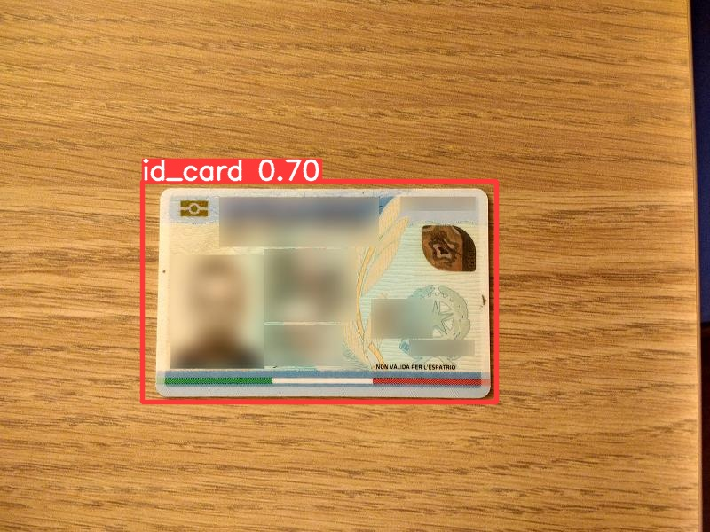

# ID-card-detector-yolov5
A Yolov5 Model that detects business cards / ID cards / credit cards.

[this project] Identify Regions of Interest (ROI) containing the required information with deep learning
[this project] Crop the regions identified above.

## How to Run

**requirements:** 

- torch
- yolov5
- python3

## Install libraries:


```
pip install torch
```

## Install and configure Yolov5

```
git clone https://github.com/ultralytics/yolov5
```
move to yolov5 directory:

```
cd yolov5
```
then install requirements:

```
pip install -r requirements.txt
```

The trained Model id_card_detection.pt you can find it here in the [Drive Link](https://drive.google.com/file/d/1eYNV2pig0dO77F_52emdbaZjqRr0vyBM/view?usp=sharing):
Download it and move it to the folder  /yolov5/runs/train/exp1/

## Test the Model

```
python3 detect.py --source test_image.jpg --weights /yolov5/runs/train/exp1/id_card_detection.pt --save-crop
```
the argument save crop: will save the cropped image after detecting the boxes

## test on ID Card:


